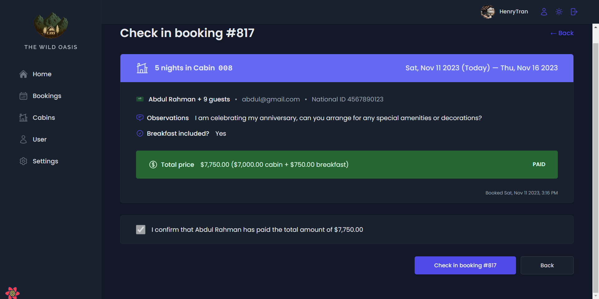

# The Wild Oasis

This is a project about booking cabin for tour traveling.

The homepage is a dashboard that can compile statistics on the number of room reservations in a day.

Dark mode:

Dark mode:

We can check in and check out from Dashboard and when we click check in or check out button it moves to checkin page:

Dark mode:

When we click check in booking it will success and return to homepage:

List of cabins that customer book:

Dark mode:

We can edit cabin that customer book (We can check information in detail, check in, delete):

There are a lot of results divided into multiple pages:

Dark mode:

We can sort data by status or sort by date:

Sort by status:

Sort by checked out:

Sort by checked in:

Sort by checked unconfirmed:

Sort by date:

Sort by date (recent):

Sort by date (earlier):

Sort by amount:

Sort by amount (high first):

Sort by amount (low first):

All available cabins:

Dark mode:

We can sort data by discount, sort by name, sort by price or sort by capacity:

Sort by No discount:

Sort by discount:

Sort by name:

Sort by name:

Sort by price (low first):

Sort by price (high first):

Sort by capacity (low first):

Sort by capacity (high first):

We can add new cabin:

Dark mode:

Click button and the form appear:

Dark mode:

Fill in information into the form:

Dark mode:

Create new cabin success:

Moreover, we can use drop down menu of each cabin row in order to duplicate, edit, delete cabin:

Drop down menu:

Duplicate cabin:

Edit cabin:

Delete cabin:

Besides that we can create new user for new staff:

Dark mode:

We can also update hotel settings:

Dark mode:

Update user account: 

Dark mode:

